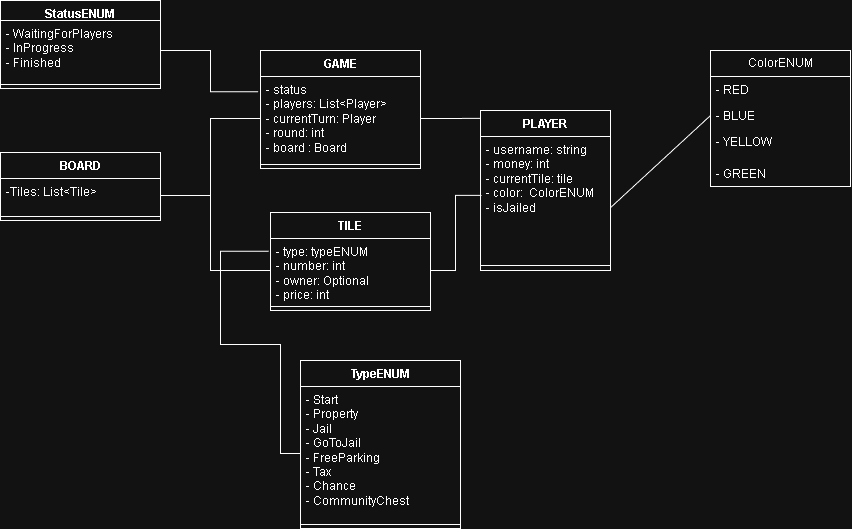
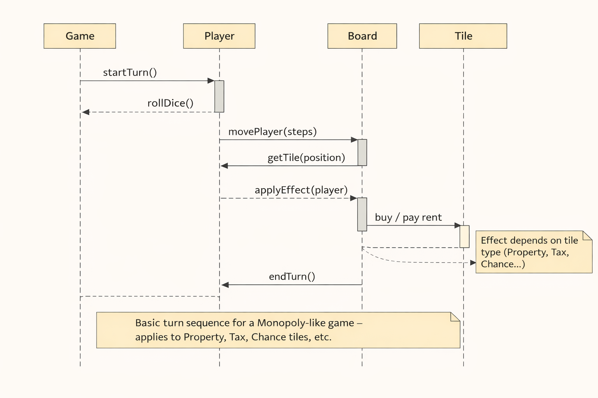
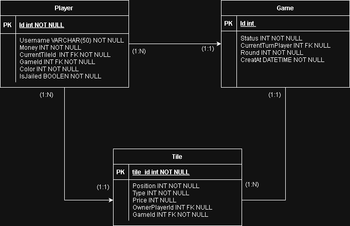

# Monopoly Game – Backend-driven Web Application

## Description
This project consists of the development of a Monopoly-like game
implemented as a backend-driven application.

The game logic is fully handled by a REST API built with ASP.NET Core
and Entity Framework Core. The frontend, developed with React and TypeScript,
is responsible only for rendering the game state and sending player actions.

The main goal of this project is to practice backend architecture,
domain-driven design, and proper frontend/backend separation.

---

## Technology Stack

### Backend
- ASP.NET Core
- Entity Framework Core
- SQL Express
- Swagger

### Frontend
- React
- TypeScript
- Tailwind CSS

---

## Scope

### Included
- Games with 2 to 4 players
- Turn-based gameplay
- Dice-based movement
- Property purchasing
- Rent payment
- Jail mechanics
- Special tiles (Go, Jail, Free Parking, etc.)

### Not included (for now)
- Auctions
- Mortgages
- Houses and hotels
- Real-time communication (WebSockets)

---

## Game Rules

- All rules are enforced by the backend
- Each player starts with $1500
- On their turn, a player rolls the dice
- If a player lands on an unowned property, they may purchase it
- If a player lands on a property owned by another player, rent is paid
- The turn ends manually

---

## Domain Model

## Domain Model

- Game
- Player
- Board
- Tile
- Property
- Turn
- DiceRoll

---

## Use Cases

- Create a game
- Join a game
- Roll dice
- Move player
- Buy property
- End turn
- Leave jail
- View game state

---

## API (Draft – Subject to change)

POST /api/game  
POST /api/game/{id}/join  
POST /api/game/{id}/roll  
POST /api/game/{id}/buy  
POST /api/game/{id}/end-turn  

---

## Roadmap

- [x] Define domain model and diagrams
- [ ] Create backend base project
- [ ] Design API contract
- [ ] Implement core game logic
- [ ] Persist game state with EF Core
- [ ] Build React frontend

---

## Notes

- All game logic will be handled exclusively in the backend
- The frontend will only display game state and available actions
- EF Core will be used with SQL Express during development

## Diagrams
### Class diagram

### Sequence     diagram

### MER diagram

